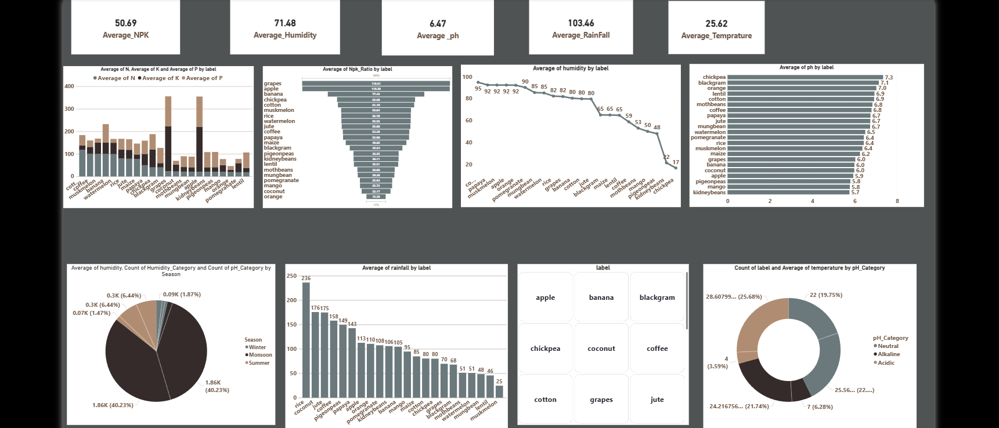

# Power-BI-Data-Analysis-Project
This projects focuses on analyzing datasets using Power BI, including data cleaning, transformation, visualization,building interactive dashboards, and extracting meaningful insights to support data-driven decision making.

<h1> CROP Recommandation </h1>

# Crop Recommendation System (Power BI Dashboard)

## Overview
This project is a Crop Recommendation System Dashboard built using Power BI.  
It helps in analyzing agricultural data and suggests suitable crops based on different environmental and soil parameters.

## Objective
The main goal of this project is to:
- Analyze agricultural data
- Provide crop recommendations
- Help farmers make data-driven decisions

## Features
- Interactive Power BI Dashboard
- Soil and environmental data analysis
- Crop recommendation insights
- Data visualization (charts, graphs, filters)
- Easy-to-understand UI

## Tools & Technologies
- Power BI (.pbix file)
- Data Visualization
- Agricultural Dataset

## Project File
- Crop_Recomendation.pbix → Main Power BI dashboard file

## How to Use
1. Download the .pbix file
2. Open it using Microsoft Power BI Desktop
3. Explore dashboard visuals and insights

## Dashboard Preview
(Add screenshots here if needed)

## Data Parameters (Example)
- Nitrogen
- Phosphorus
- Potassium
- Temperature
- Humidity
- pH value
- Rainfall
- 
## Use Cases
- Farmers for crop planning
- Agriculture students for analysis
- Researchers for insights
- 
## Contribution
Feel free to fork this repository and contribute.

## License
This project is for educational purposes.

## Dashboard Preview
(Add screenshots here if needed)

## Key Metrics (Example)
- Total Sales
- Total Revenue
- Profit
- Quantity Sold
- Region-wise Sales
- Product-wise Performance
- 
# Use Cases
- Business analysis
- Sales performance tracking
- Data-driven decision making
- Learning Power BI dashboards
- 
## Contribution
Feel free to fork this repository and contribute.

# License
This project is for educational purposes.
