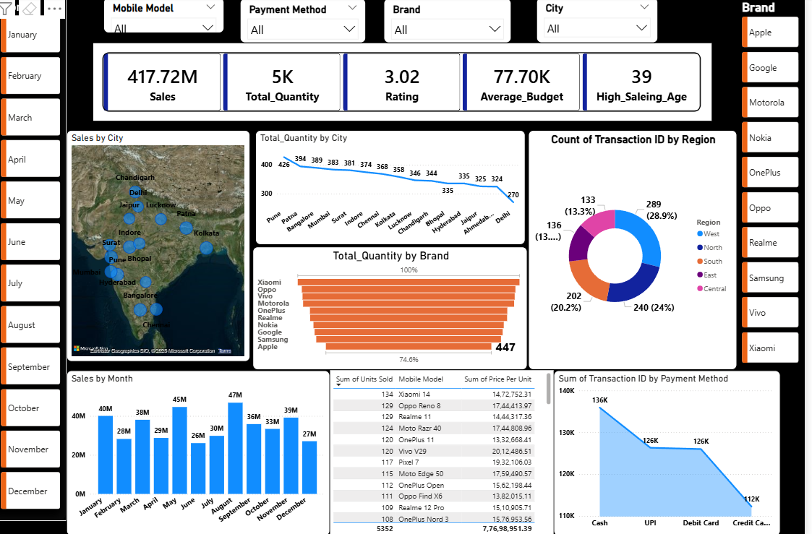

# Power-BI-Data-Analysis-Project
This projects focuses on analyzing datasets using Power BI, including data cleaning, transformation, visualization,building interactive dashboards, and extracting meaningful insights to support data-driven decision making.

<h1> CROP Recommandation </h1>

<h1> Mobile sales analysis </h1>

