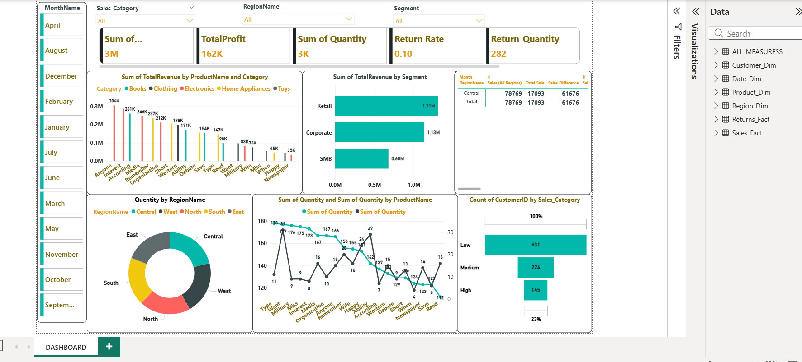
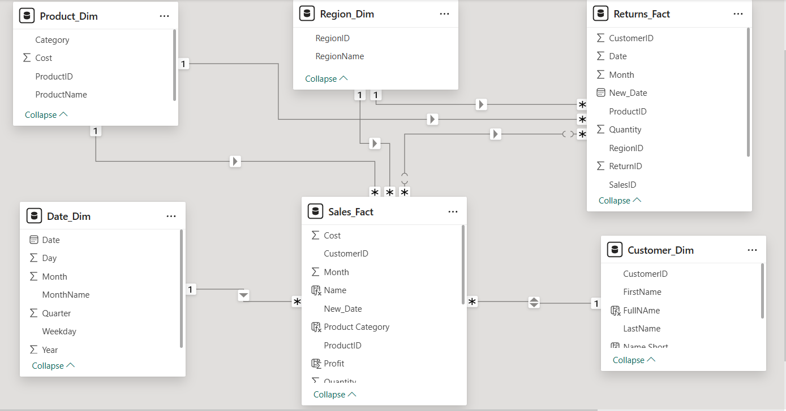
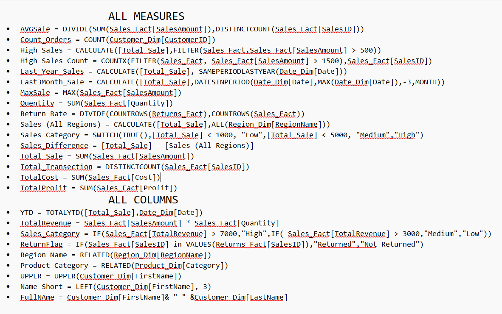
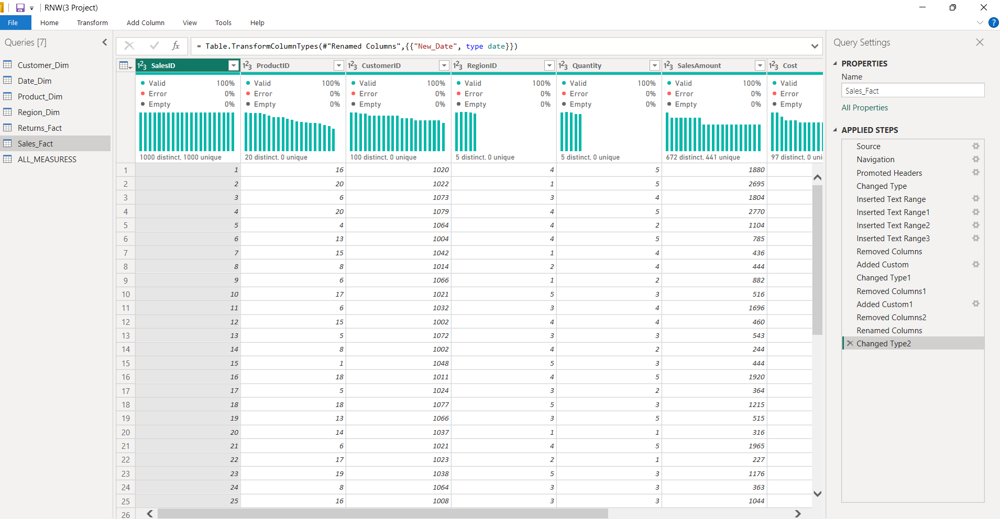
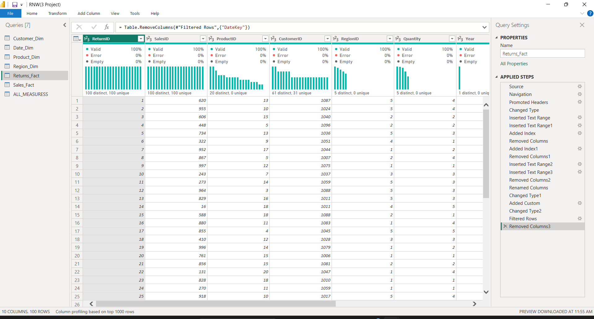
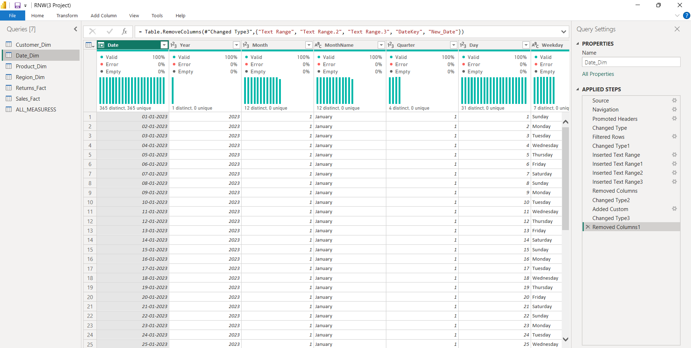
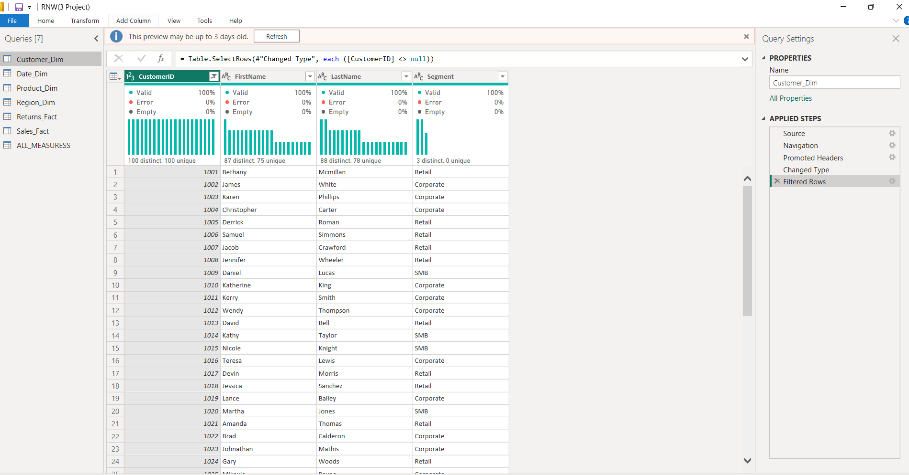
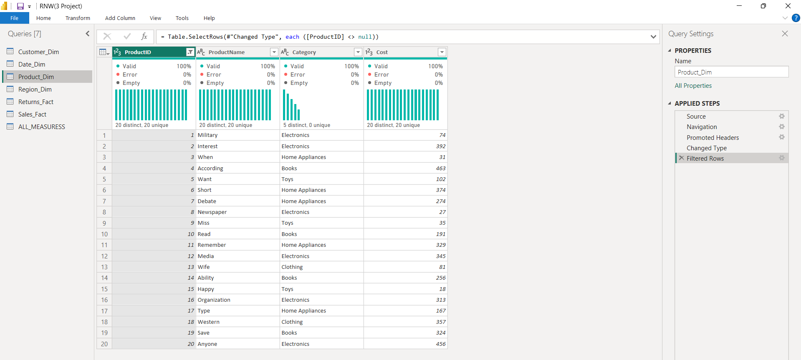
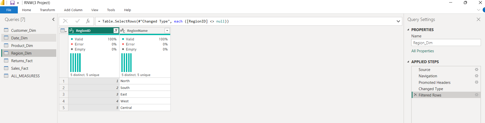

 Power BI Dashboard Project

## Overview
This project showcases an interactive and visually appealing dashboard built using Power BI. The dashboard is designed to provide meaningful insights through data visualization, helping users make data-driven decisions efficiently.

## Features
- Interactive and user-friendly dashboard
- Clean and attractive design
- Dynamic filtering and slicing options
- Key performance indicators (KPIs)
- Data visualization using charts, graphs, and tables
- Drill-down and drill-through capabilities

## Tools and Technologies
- Power BI Desktop
- Data Modeling
- DAX (Data Analysis Expressions)
- Data Visualization Techniques

## File Information
- `RNW(3 Project).pbix` - Main Power BI dashboard file

## How to Use
1. Download the `.pbix` file from this repository
2. Open it using Power BI Desktop
3. Explore the dashboard using filters and visuals

## Insights Provided
- Overview of key metrics
- Trend analysis
- Comparative analysis
- Performance tracking

## Purpose
The purpose of this project is to demonstrate data visualization skills and the ability to transform raw data into actionable insights using Power BI.

## Future Improvements
- Add more advanced analytics
- Integrate real-time data sources
- Enhance dashboard performance

Modeling

 Power BI Sales and Returns Dashboard

## Overview
This project presents an interactive Power BI dashboard built using a structured data model consisting of fact and dimension tables. The dashboard provides insights into sales performance, product trends, customer behavior, and returns analysis.

The data model follows a star schema design to ensure efficient querying and better performance.

## Data Model
The project is designed using the following tables:

### Fact Tables
- **Sales_Fact**
  - Contains transactional sales data
  - Includes metrics like Cost, Profit, Quantity
  - Linked with Product, Customer, Region, and Date dimensions

- **Returns_Fact**
  - Contains product return data
  - Tracks returned quantities and related details
  - Connected with Product, Region, and Date

### Dimension Tables
- **Product_Dim**
  - Product details such as ProductID, ProductName, Category, and Cost

- **Customer_Dim**
  - Customer information including CustomerID, FullName, FirstName, LastName

- **Region_Dim**
  - Regional information including RegionID and RegionName

- **Date_Dim**
  - Date-related attributes such as Year, Quarter, Month, Day, Weekday

## Relationships
- One-to-many relationships between dimension tables and fact tables
- Centralized fact table (**Sales_Fact**) connected to all dimensions
- Returns_Fact shares relationships with Product, Region, and Date
- Proper key-based joins using IDs (ProductID, CustomerID, RegionID, Date)

Dax Formulas

# Power BI DAX Measures and Calculations

## Overview
This file contains DAX measures and calculated columns used in the Power BI dashboard to analyze sales, customers, and returns data.

## Measures Included
- **Total Sales**: Sum of sales amount  
- **Average Sale**: Average sales per transaction  
- **Total Transactions**: Count of unique sales  
- **Total Profit & Cost**: Overall profit and cost calculation  
- **Quantity**: Total items sold  
- **Return Rate**: Ratio of returned orders to total sales  
- **High Sales Metrics**: Filtered calculations for high-value sales  
- **Time Intelligence**:
  - Last Year Sales
  - Last 3 Months Sales
- **Sales Comparison**:
  - Sales (All Regions)
  - Sales Difference
- **Sales Category**: Classification (Low, Medium, High)

## Calculated Columns
- **Total Revenue**: SalesAmount × Quantity  
- **Sales Category**: Based on revenue thresholds  
- **Return Flag**: Returned / Not Returned  
- **Region Name & Product Category**: Using relationships  
- **Customer Transformations**:
  - Uppercase Name
  - Short Name
  - Full Name

## Functions Used
- CALCULATE, SUM, COUNT, DISTINCTCOUNT  
- FILTER, COUNTROWS, MAX  
- DIVIDE, SWITCH, IF  
- RELATED, VALUES  
- Time Intelligence (TOTALYTD, SAMEPERIODLASTYEAR, DATESINPERIOD)

#Data Transformation
- 
- 
- 
- 
- 
- 
- # Power BI Data Transformation (Power Query)

## Overview
This project includes data cleaning and transformation steps performed in Power Query to prepare raw data for analysis in Power BI.

## Tables Processed
- Sales_Fact
- Returns_Fact
- Customer_Dim
- Product_Dim
- Region_Dim
- Date_Dim

## Key Transformations

### Data Cleaning
- Removed null values from key columns (CustomerID, ProductID, RegionID)
- Removed unnecessary columns (DateKey, extra text columns)
- Ensured all columns have correct data types

### Data Transformation
- Renamed columns for better readability
- Added custom columns where required
- Filtered rows to maintain valid data
- Created proper date format (New_Date)

### Data Structuring
- Maintained star schema structure
- Ensured consistency between fact and dimension tables
- Applied indexing where needed

## Tools Used
- Power BI Power Query Editor
- M Language (Power Query Formula Language)

## Purpose
These transformations ensure:
- Clean and reliable dataset
- Improved performance of dashboard
- Accurate reporting and analysis

## Usage
All transformations are applied in Power Query before loading data into the Power BI model.
