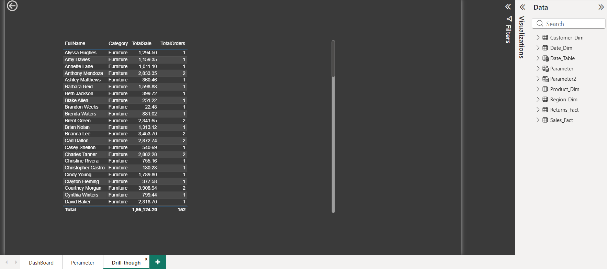

# Sales, Returns & Customer Performance Dashboard

A comprehensive Power BI dashboard designed to analyze sales performance, customer behavior, and product returns for data-driven decision-making.

---

## Overview

This Power BI project provides an interactive dashboard that helps businesses monitor key performance metrics such as sales, profit, customer contribution, and return rates.

It enables stakeholders to:
- Track sales trends over time
- Identify high-value customers
- Analyze product performance
- Understand return patterns

The dashboard supports business decisions by turning raw data into actionable insights.

---

## Features

- Interactive dashboard with slicers and filters
- KPI cards for quick performance tracking
- Drill-down capabilities for detailed analysis
- Dynamic visuals (charts, tables, maps)
- Time-based analysis using date hierarchy
- Customer and product segmentation
- Return analysis and comparison

---

## Tools and Technologies

- Power BI Desktop
- DAX (Data Analysis Expressions)
- Data Modeling (Star Schema)
- Power Query (ETL Process)

---

## File Information

- Sales_Return_CustomerPerformance.pbix – Main Power BI dashboard file
- Customer_Dim.png – Customer dimension reference
- Date_Dim.png – Date dimension reference
- Modeling.png – Data model structure
- Dax_Formulas.png – DAX calculations reference
- Dashboard.png – Dashboard preview

---

## Dashboard Insights

- Sales show a clear upward trend with seasonal fluctuations
- Top customers contribute a significant portion of total revenue
- Certain product categories have higher return rates
- Regional performance varies significantly across locations
- Profit margins differ across product segments

---

## Data Model

The project follows a Star Schema design for optimized performance and scalability.

### Fact Tables
- Sales Fact – Contains transaction-level sales data
- Returns Fact – Tracks returned products and return quantities

### Dimension Tables
- Customer Dimension – Customer details and segmentation
- Product Dimension – Product categories and attributes
- Region Dimension – Geographic data
- Date Dimension – Time-based hierarchy (Year, Quarter, Month)

---

## DAX Calculations

### Measures
- Total Sales = SUM(Sales[Amount])
- Total Profit = SUM(Sales[Profit])
- Return Rate = DIVIDE([Total Returns], [Total Sales], 0)
- Total Orders = COUNT(Sales[OrderID])

### Calculated Columns
- Profit Margin
- Customer Segment
- Product Category Mapping

### Key Functions Used
- CALCULATE()
- SUM()
- FILTER()
- DIVIDE()
- COUNT()
- RELATED()

---

## Data Transformation (Power Query)

- Removed null and duplicate records
- Standardized column names and formats
- Created custom columns for business logic
- Merged and appended multiple datasets
- Converted data types appropriately
- Structured tables for efficient modeling

---

## Dashboard Screenshots

### Main Dashboard
.png)
.png)

### Data Model View

### Customer Dimension

### Date Dimension

### DAX Calculations

---

## How to Use

1. Download the .pbix file from the repository
2. Open it using Power BI Desktop
3. Explore the dashboard using filters and slicers
4. Interact with visuals for drill-down analysis
5. Review KPIs and insights for decision-making

---

## Purpose

This project was built to demonstrate practical skills in Power BI, including data modeling, DAX calculations, and dashboard design. It showcases the ability to transform raw data into meaningful business insights.

---

## Future Improvements

- Add real-time data integration
- Implement advanced forecasting using time series analysis
- Enhance UI/UX with more custom visuals and tooltips
