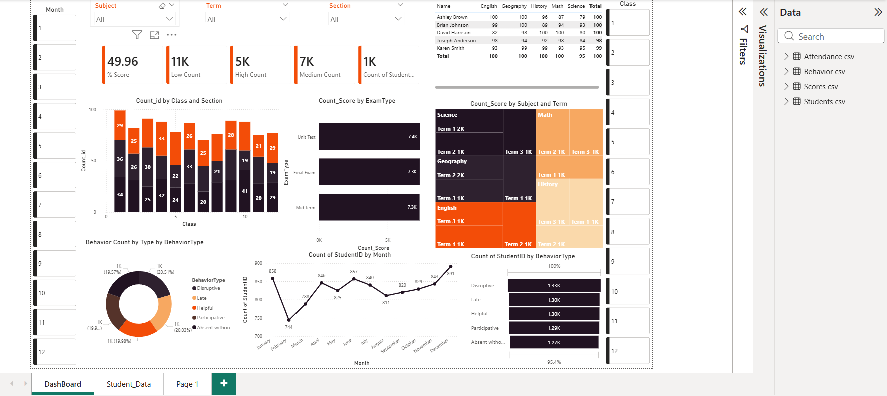
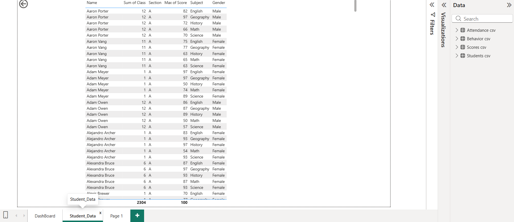
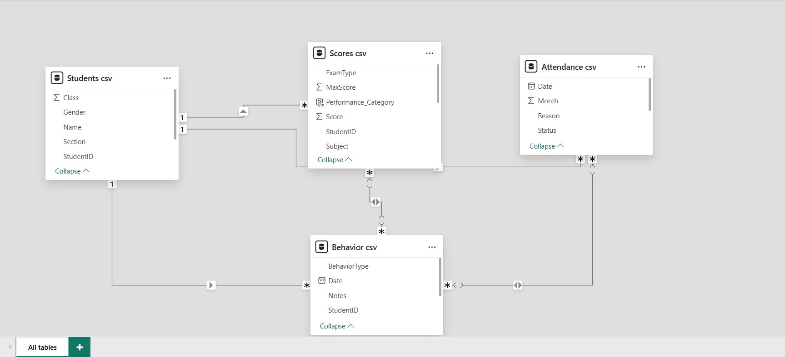
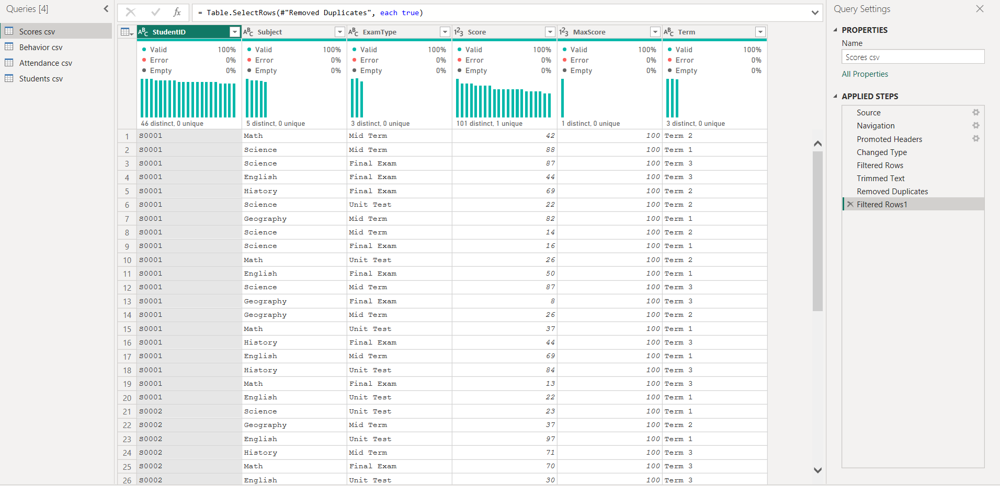
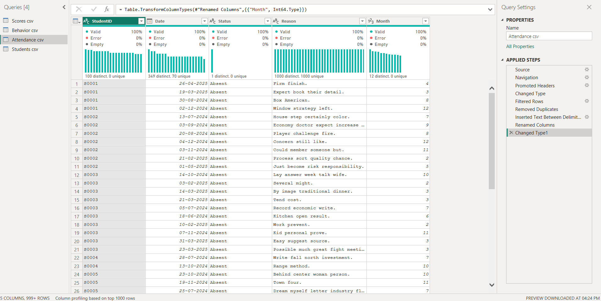
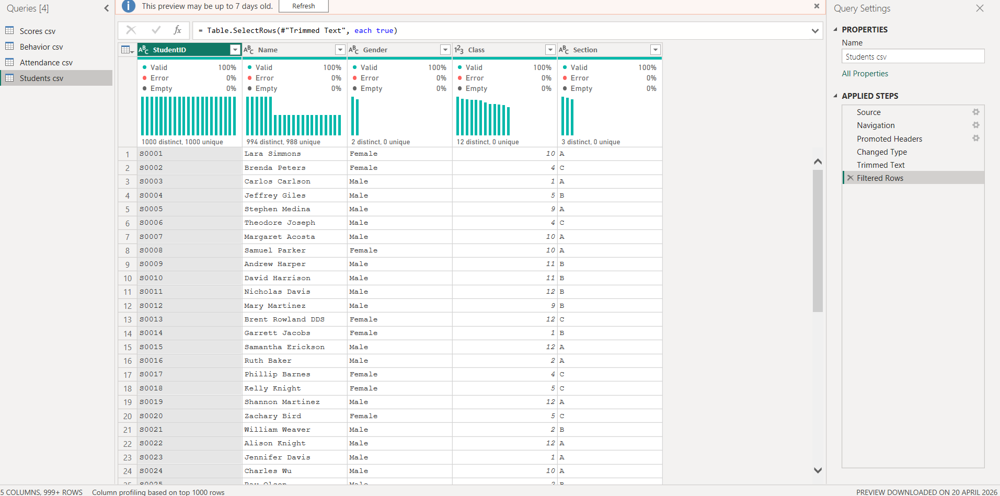
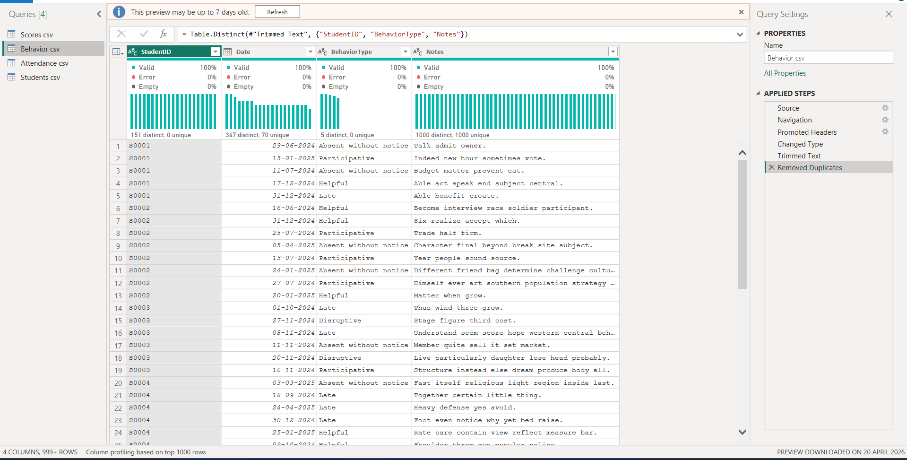
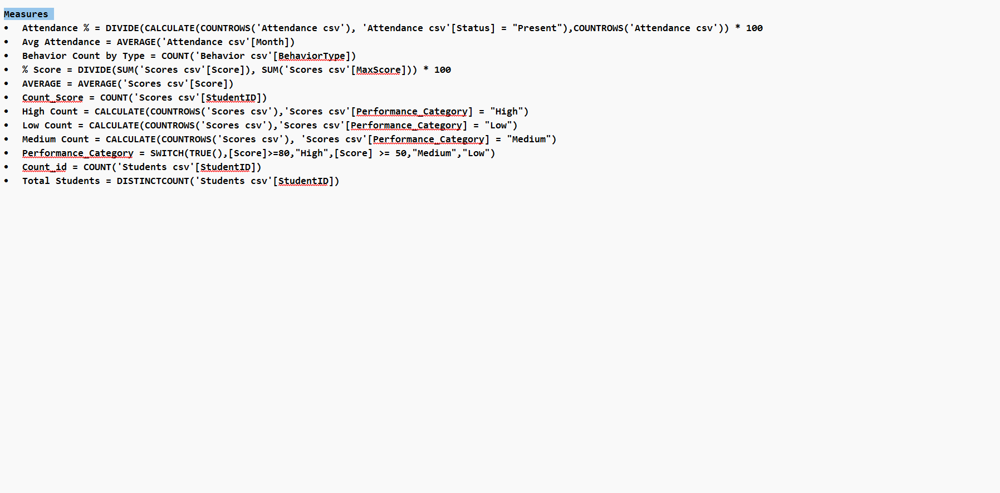

# Student Analysis Dashboard (Power BI)

### Main Dashboard

### Data Modeling View

### Student_Details

### Data Modeling

### Score Fact

### Attendence Dimension

### Student Dimension

### Behaviour Dimansion

### DAX Calculations

## Overview
This project is a Student Analysis Dashboard developed using Power BI.  
It provides insights into student performance, behavior, and academic trends through interactive visualizations.

---

## Objective
The main objective of this project is to:
- Analyze student academic performance
- Identify trends and patterns in student data
- Support data-driven decision making in education

---

## Features
- Interactive and dynamic Power BI dashboard
- Student performance analysis
- Subject-wise and overall score insights
- Attendance and behavioral trends
- Easy-to-use filters and visuals

---

## Tools & Technologies
- Power BI (.pbix file)
- Data Visualization
- Educational Dataset

---

## Project File
- Student_Analysis.pbix → Main dashboard file

---

## How to Use
1. Download the .pbix file
2. Open it using Microsoft Power BI Desktop
3. Explore the dashboard and insights

---

## Dashboard Preview
(Add screenshots here for better presentation)

---

## Key Insights (Example)
- Student performance distribution
- Subject-wise analysis
- Attendance trends
- High and low performing students

---

## Use Cases
- Schools and colleges for performance tracking
- Teachers for student evaluation
- Students for self-assessment
- Data analysis practice using Power BI

---

## Contribution
Contributions are welcome. Feel free to fork this repository and improve it.

---

## License
This project is created for educational purposes.

---

## Author
Your Name
